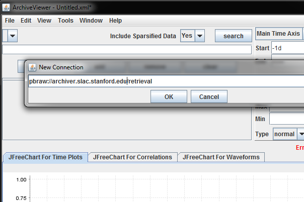

# Retrieving data using the ArchiveViewer

The EPICS Archiver Appliance comes with a client plugin for the
ArchiveViewer that enables the user to retrieve and display data in the
ArchiveViewer using the [PB/HTTP](../developer/pb_pbraw) protocol. To download a
version of the Archive Viewer with the client plugin for the EPICS
Archiver Appliance, please see the
[Download](https://github.com/slacmshankar/epicsarchiverap/releases/)\'s
section.

To retrieve data, start the Archive Viewer and connect to the EPICS
Archiver Appliance using a URL that looks like so
`pbraw://archiver.slac.stanford.edu/retrieval`. This URL is generated by
replacing the string _http_ with the string _pbraw_ in the
`data_retrieval_url` element of your `appliances.xml`.

Once you have established a connection to the server, you should be able
to use the Archive Viewer as before to retrieve and display data.

The Archive Viewer is also used to retrieve data from the Channel
Archiver; this has a concept of indexes that form part of the data
retrieval request. There is no equivalent concept in the EPICS Archiver
Appliance; so we have a dummy client-side only entry called _Default_
that is used.
